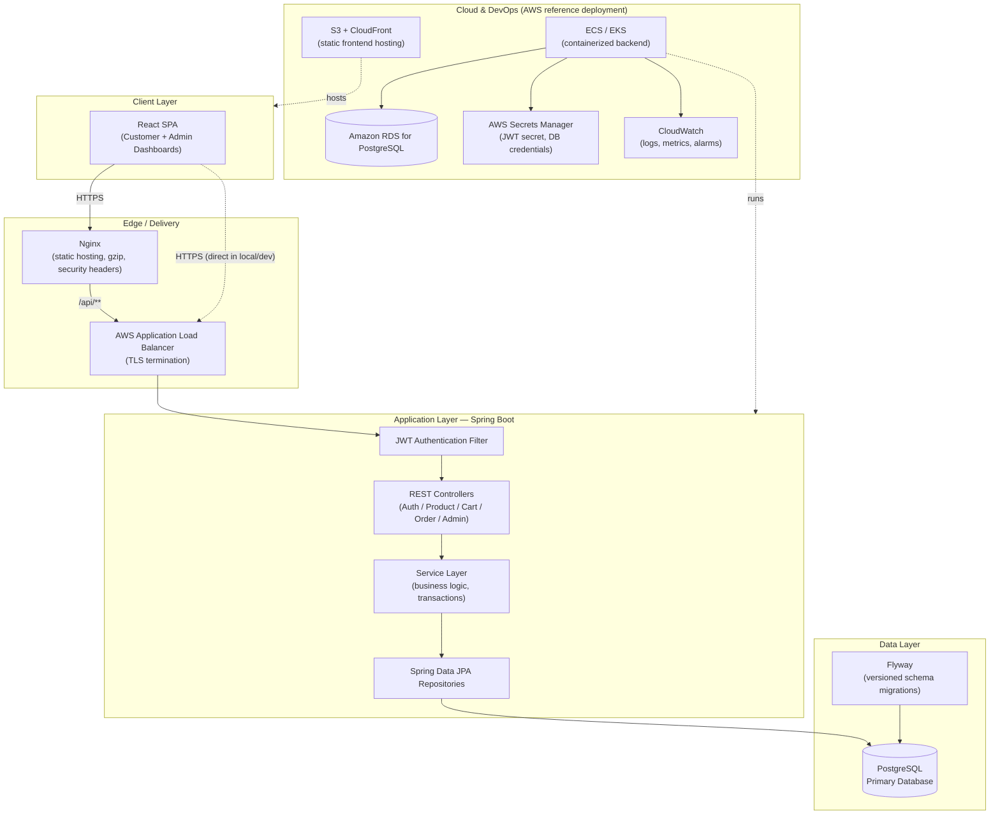
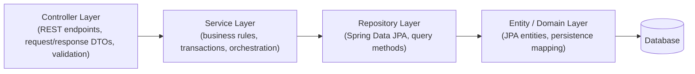
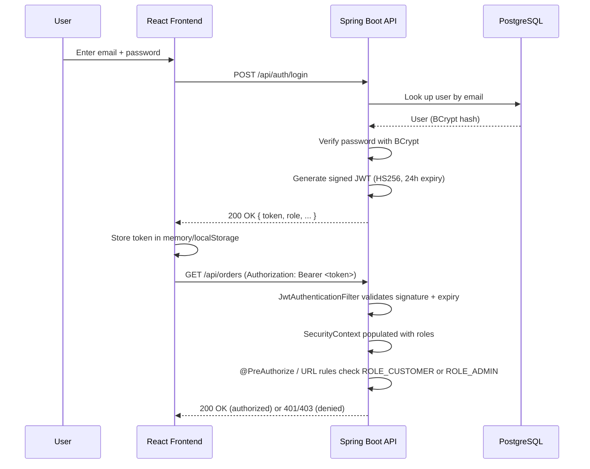

# System Architecture

## High-Level Architecture

## Layered Backend Architecture

The backend follows a strict **layered architecture** to keep concerns separated and code testable:

- **Controllers** never talk to repositories directly — they always go through a service.
- **Services** own transaction boundaries (`@Transactional`) and business invariants (e.g. stock checks, price snapshotting on order placement).
- **DTOs** are used at the API boundary so entities are never serialized directly to clients (prevents accidental exposure of fields like `password`).
- **GlobalExceptionHandler** centralizes error translation so no layer needs to format HTTP responses itself.

## Security Architecture

Key controls implemented:

| Control | Implementation |
|---|---|
| Authentication | Stateless JWT (HS256), issued on login/register |
| Password storage | BCrypt, work factor 12 — never stored or logged in plaintext |
| Authorization | Role-Based Access Control (`ROLE_CUSTOMER`, `ROLE_ADMIN`) via Spring Security URL rules + method-level `@PreAuthorize` |
| Transport | HTTPS enforced at the load balancer / reverse proxy |
| CORS | Explicit allow-list of trusted origins |
| Input validation | Jakarta Bean Validation on every request DTO |
| Error handling | `GlobalExceptionHandler` — no stack traces or internal messages ever reach the client |
| Auditability | `AuditLog` entries for login attempts, order placement, and admin mutations |
| Data integrity | Optimistic locking (`@Version`) on `Product` to prevent overselling under concurrent checkout |
| Secrets | Injected via environment variables / AWS Secrets Manager — never hard-coded |

## Reference AWS Deployment

This project is designed to map cleanly onto a standard AWS deployment, without requiring one to run locally:

- **Compute:** Backend container deployed to **ECS Fargate** (or EKS) behind an **Application Load Balancer**
- **Database:** **Amazon RDS for PostgreSQL** (Multi-AZ for production)
- **Frontend:** Static build served from **S3** behind **CloudFront**
- **Secrets:** **AWS Secrets Manager** for `JWT_SECRET` and DB credentials, injected as environment variables at task startup
- **Observability:** **CloudWatch** for centralized logs and metrics; Spring Boot Actuator exposes `/actuator/health` for ALB health checks
- **CI/CD:** GitHub Actions builds and pushes Docker images to **Amazon ECR**, then triggers an ECS service update (see `.github/workflows/ci-cd.yml`)
