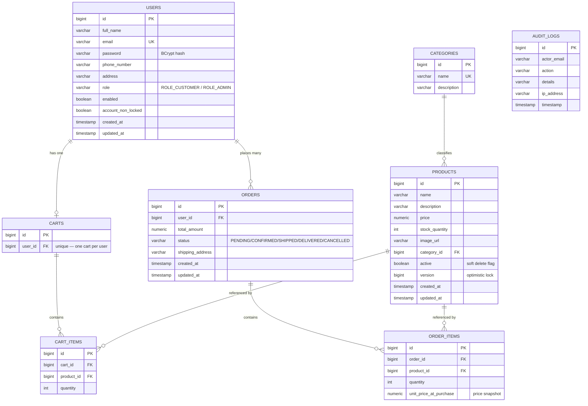

# Database Schema (Entity-Relationship Diagram)

Target database: **PostgreSQL 16** (schema owned and versioned by Flyway — see `backend/src/main/resources/db/migration`).

## Design Notes

- **Price snapshotting** — `order_items.unit_price_at_purchase` captures the price at checkout time, so historical orders stay accurate even if a product's price later changes. `cart_items` deliberately has no such snapshot, since cart contents are expected to reflect live prices.
- **Soft delete for products** — `products.active` is used instead of hard deletes so that historical `order_items` referencing a discontinued product remain valid and queryable.
- **Optimistic locking** — `products.version` (JPA `@Version`) prevents lost updates when two checkouts race to decrement the same product's stock.
- **One cart per user** — enforced with a `UNIQUE` constraint on `carts.user_id`.
- **Audit trail** — `audit_logs` is intentionally decoupled from the transactional tables (no foreign keys) so audit writes never fail or roll back a business transaction, and so the table can later be shipped to a separate log store without a schema change.
- **Indexes** — added on all foreign keys and frequently filtered/searched columns (`users.email`, `products.name`, `products.category_id`, `orders.user_id`, `orders.status`, `audit_logs.timestamp`).
