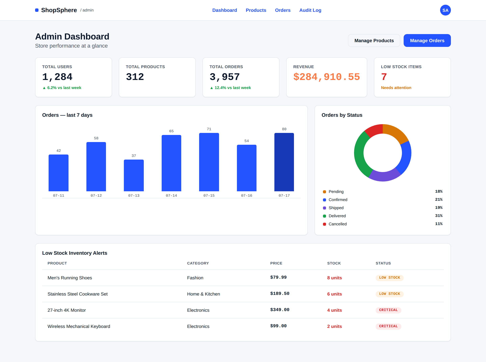
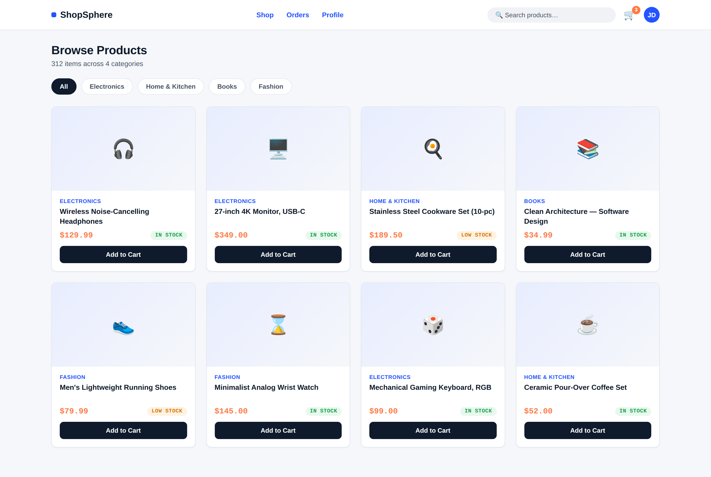
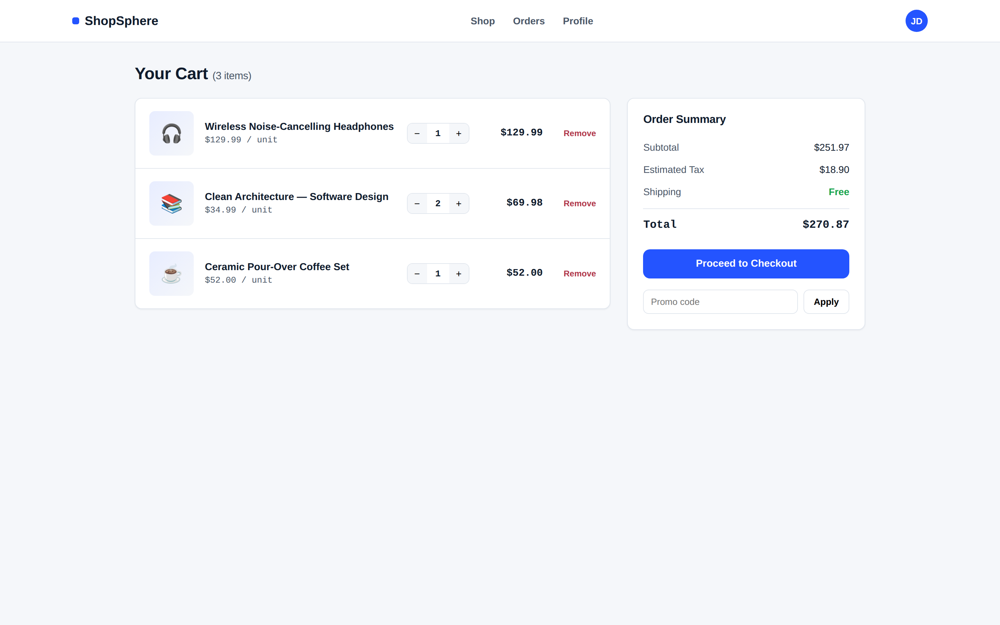
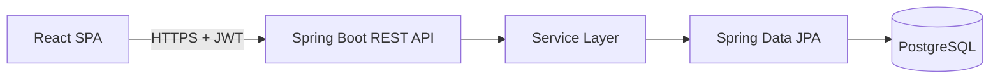

# Cloud-Native Secure E-Commerce Platform

A production-style, full-stack e-commerce application built to demonstrate enterprise backend engineering, application security, and cloud-native deployment practices — the kind of system used by real online retail platforms.

[](.github/workflows/ci.yml)
[]()
[]()
[]()
[](LICENSE)

---

## Overview

This project simulates a real-world e-commerce backend and admin/customer web experience, covering the full product lifecycle: catalog browsing, cart management, checkout, order tracking, and admin analytics — secured end-to-end with JWT-based authentication and role-based access control.

It's built to reflect how a professional engineering team would structure the codebase: layered architecture, centralized exception handling, versioned database migrations, automated tests, containerization, and a CI/CD pipeline — not a single-file tutorial project.

## Features

### Customer-Facing
- Registration & login with JWT authentication
- Browse, search, and filter products by category
- Shopping cart with live quantity and subtotal calculation
- Checkout with stock validation and order placement
- Order history and order detail tracking
- Profile management

### Admin
- Role-protected admin dashboard (`ROLE_ADMIN`)
- Live metrics: total users, products, orders, revenue
- Low-stock inventory alerts
- Order analytics (orders by status, last-7-days order volume)
- Product CRUD (create, update, deactivate)
- Order status management (Pending → Confirmed → Shipped → Delivered / Cancelled)
- Audit log viewer (login attempts, admin actions)

### Engineering / Platform
- Stateless JWT authentication with Spring Security
- Role-Based Access Control enforced at both the URL filter chain and method level (`@PreAuthorize`)
- BCrypt password hashing (work factor 12)
- Centralized validation (Jakarta Bean Validation) and global exception handling
- Optimistic locking on product stock to prevent overselling under concurrent checkout
- Price snapshotting on order line items (historical orders stay accurate)
- Versioned schema migrations via Flyway
- Async audit logging for security-relevant events
- OpenAPI/Swagger documentation
- Dockerized backend, frontend, and database with a single `docker-compose up`
- GitHub Actions CI (build + test on every push) and a reference CD pipeline to AWS EC

## 📸 Application Screenshots

The screenshots below demonstrate the implemented frontend interface and application workflow.

### 🛠️ Admin Dashboard



Revenue, order, and inventory analytics displayed through the admin interface.

---

### 🛒 Product Catalog



Customer-facing product browsing with search and category filtering.

---

### 🛍️ Shopping Cart



Cart management with quantity updates and live price calculation.
## Technology Stack

**Backend**
- Java 17, Spring Boot 3.3
- Spring Security (JWT, method security)
- Spring Data JPA / Hibernate
- Flyway (database migrations)
- springdoc-openapi (Swagger UI)
- Maven, Lombok, MapStruct-ready DTO layer

**Database**
- PostgreSQL 16 (production), H2 (zero-setup local development)

**Frontend**
- React 18 (Create React App)
- React Router v6
- Axios (with JWT interceptor + global 401 handling)
- Recharts (admin analytics charts)
- Context API for auth/cart state

**Cloud & DevOps**
- Docker (multi-stage builds for both services)
- Docker Compose (local orchestration)
- Nginx (frontend static hosting + reverse proxy headers)
- GitHub Actions (CI/CD)
- AWS reference architecture: ECS Fargate, RDS for PostgreSQL, S3 + CloudFront, Secrets Manager, CloudWatch

## Architecture

Full diagrams (system architecture, layered backend, security sequence flow) are in [`docs/ARCHITECTURE.md`](docs/ARCHITECTURE.md).



## Database Schema

Full ER diagram and design notes are in [`docs/DATABASE_SCHEMA.md`](docs/DATABASE_SCHEMA.md). Schema is owned by versioned Flyway migrations in `backend/src/main/resources/db/migration`.

## Getting Started

### Option A — Docker Compose (recommended, closest to production)

Requires Docker and Docker Compose.

```bash
git clone https://github.com/<your-username>/cloud-native-secure-ecommerce-platform.git
cd cloud-native-secure-ecommerce-platform

cp backend/.env.example .env
# Edit .env and set a strong JWT_SECRET (e.g. `openssl rand -base64 64`) and DB_PASSWORD

docker compose --env-file .env up --build
```

- Frontend: http://localhost:3000
- Backend API: http://localhost:8080/api
- Swagger UI: http://localhost:8080/swagger-ui.html

A default admin account and sample catalog are seeded automatically (see [Seed Data](#seed-data--default-credentials) below).

### Option B — Run Locally Without Docker

**Backend** (uses an in-memory H2 database by default — no PostgreSQL setup required):

```bash
cd backend
mvn spring-boot:run
# API available at http://localhost:8080
```

**Frontend:**

```bash
cd frontend
npm install
npm start
# App available at http://localhost:3000
```

### Seed Data / Default Credentials

| Role | Email | Password |
|---|---|---|
| Admin | `admin@ecommerce.local` | `Admin@123` |

> Change this password immediately in any non-local environment. Register a new account via `/api/auth/register` for a customer-role user.

## API Documentation

Interactive API documentation is generated with springdoc-openapi and available at:

```
http://localhost:8080/swagger-ui.html
```

All endpoints requiring authentication expect a header:

```
Authorization: Bearer <jwt_token>
```

Key endpoint groups:

| Group | Base Path | Access |
|---|---|---|
| Auth | `/api/auth` | Public |
| Products | `/api/products` | Public (read), Admin (write) |
| Categories | `/api/categories` | Public (read), Admin (write) |
| Cart | `/api/cart` | Authenticated |
| Orders | `/api/orders` | Authenticated |
| Admin Dashboard | `/api/admin/**` | Admin only |
| User Profile | `/api/users/me` | Authenticated |

## Testing

```bash
cd backend
mvn test
```

Unit tests use JUnit 5, Mockito, and AssertJ, and cover service-layer business logic (see `backend/src/test/java/.../ProductServiceTest.java` for an example covering catalog lookups, not-found handling, and audit-log side effects). The layered architecture keeps services independently testable without a Spring context or database.

## Docker & Deployment

Each service has its own multi-stage `Dockerfile`:

- `backend/Dockerfile` — Maven build stage → minimal JRE Alpine runtime, runs as a non-root user, includes a container `HEALTHCHECK`.
- `frontend/Dockerfile` — Node build stage → Nginx runtime serving the static production bundle with gzip and security headers.

`docker-compose.yml` at the repo root wires up PostgreSQL, the backend, and the frontend with health-check-gated startup ordering.

For a cloud deployment, see the AWS reference architecture and the GitHub Actions CD pipeline (`.github/workflows/cd.yml`) that builds both images, pushes to Amazon ECR, and triggers an ECS rolling deployment.

## Project Structure

```
cloud-native-secure-ecommerce-platform/
├── backend/
│   ├── src/main/java/com/ecommerce/platform/
│   │   ├── config/          # Security, Swagger configuration
│   │   ├── controller/      # REST controllers
│   │   ├── dto/             # Request/response DTOs
│   │   ├── entity/          # JPA entities
│   │   ├── exception/       # Custom exceptions + global handler
│   │   ├── repository/      # Spring Data JPA repositories
│   │   ├── security/        # JWT filter, util, UserDetailsService
│   │   └── service/         # Business logic
│   ├── src/main/resources/
│   │   ├── db/migration/    # Flyway migrations (PostgreSQL)
│   │   └── application.yml
│   ├── src/test/            # Unit tests
│   └── Dockerfile
├── frontend/
│   ├── src/
│   │   ├── api/             # Axios API clients
│   │   ├── components/      # Reusable UI components
│   │   ├── context/         # Auth & Cart context providers
│   │   ├── pages/           # Route-level pages (customer + admin)
│   │   └── routes/          # ProtectedRoute / AdminRoute guards
│   └── Dockerfile
├── docs/
│   ├── ARCHITECTURE.md      # System + security architecture diagrams
│   └── DATABASE_SCHEMA.md   # ER diagram and schema design notes
├── .github/workflows/       # CI and CD pipelines
├── docker-compose.yml
└── README.md
```

## Security Highlights

See [`docs/ARCHITECTURE.md`](docs/ARCHITECTURE.md#security-architecture) for the full breakdown. Summary:

- Stateless JWT auth (HS256), no server-side session state
- BCrypt password hashing, passwords never logged or serialized
- RBAC enforced at both the filter-chain and method level (defense in depth)
- Centralized, leak-free error responses (no stack traces to clients)
- Optimistic locking to prevent stock-overselling race conditions
- Async audit logging of authentication and admin actions
- Secrets loaded from environment variables / AWS Secrets Manager — never hard-coded

## Future Enhancements

- Refresh-token rotation and token revocation (currently single-token JWT expiry)
- Payment gateway integration (Stripe) with webhook-driven order confirmation
- Redis caching layer for product catalog reads
- Elasticsearch-backed product search and faceted filtering
- Email notifications (order confirmation, shipping updates) via SES
- Multi-region deployment and read replicas for the database
- Rate limiting / WAF rules at the API gateway layer
- End-to-end test suite (Cypress/Playwright) alongside the existing unit tests

## Resume Description

> **Cloud-Native Secure E-Commerce Platform** — Designed and built a full-stack e-commerce platform (Java 17, Spring Boot, Spring Security, PostgreSQL, React) implementing JWT authentication, role-based access control, and a layered service architecture; containerized with Docker and deployed via a GitHub Actions CI/CD pipeline targeting AWS ECS/RDS. Implemented optimistic-locking-protected inventory management, an admin analytics dashboard, and centralized audit logging for security compliance.

---

**License:** MIT — see [LICENSE](LICENSE).
